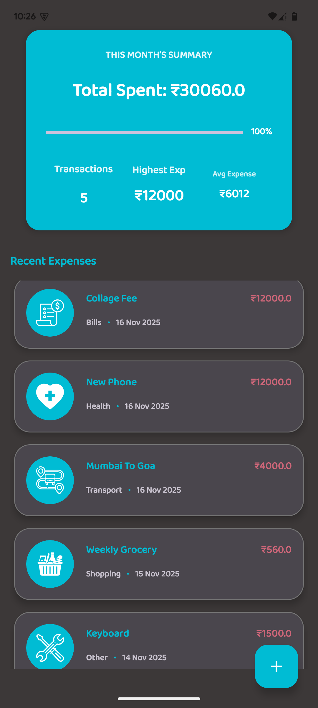
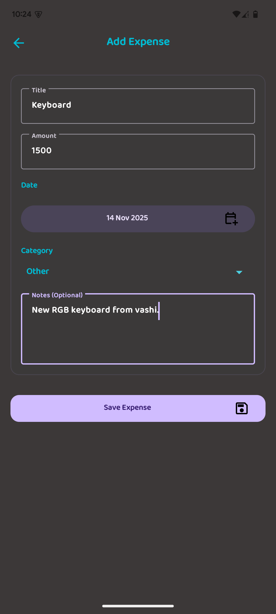
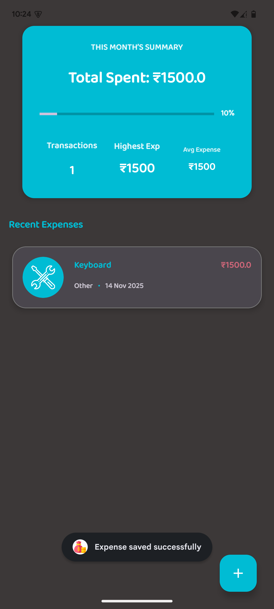
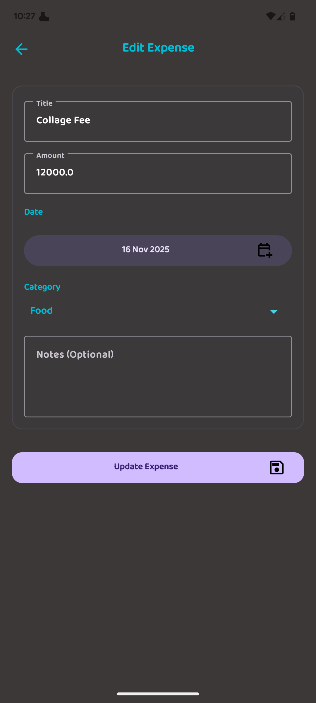
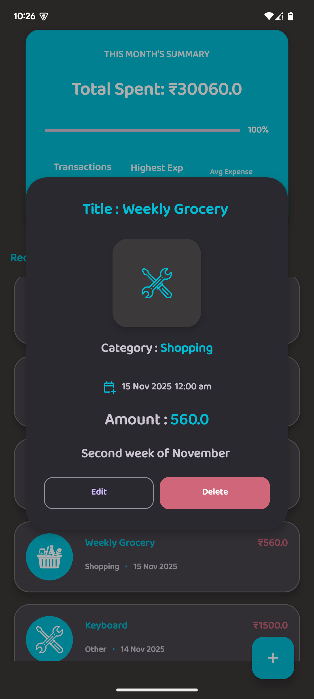
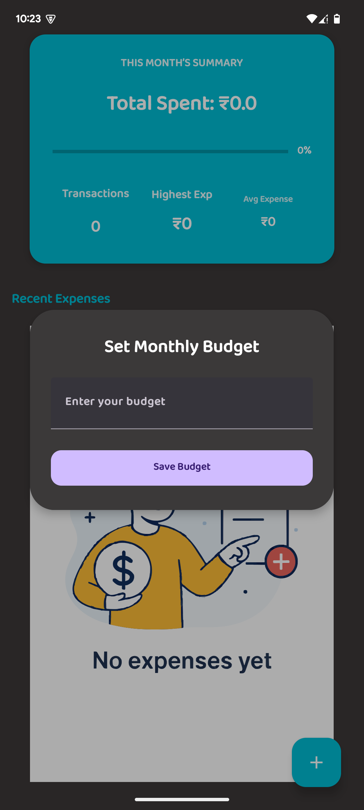
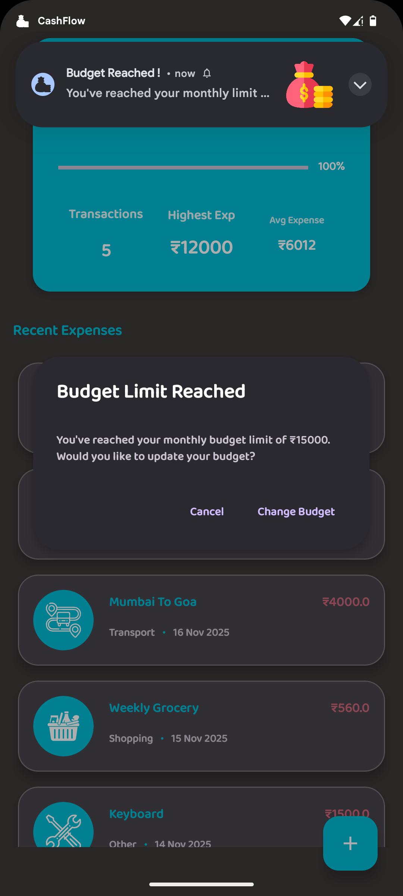

# CashFlow (Android)

A simple, clean expense tracker and budget manager for Android. Track spending, set a monthly budget, and get clear feedback as you add, edit, and review expenses.

## Overview
- Add new expenses with amount, title, date, and category.
- Edit or delete existing expenses.
- Set a monthly budget and monitor remaining balance.
- Visual cues warn you as you approach or exceed your budget.
- View detailed information for each expense.

## Screenshots
Below are screenshots to give you a feel for the UI and main flows of the app.

### Home

_The Home screen shows your budget status and a list of recent expenses._

### Add Expense

_Add a new expense with amount, title, category, and date._

### Expense Saved

_A confirmation message appears when a new expense is saved successfully._

### Edit Expense

_Update any field of an existing expense and save your changes._

### Expense Details

_View full details of a selected expense, including date and category._

### Set Budget

_Set or update your monthly budget directly from the app._

### Warnings

_Clear warning UI appears when you approach or exceed your set budget._

## Features
- Budget tracking: define a spending limit and see your remaining budget.
- Expense management: add, edit, and view detailed entries.
- Helpful feedback: inline confirmations and warnings.
- Simple, intuitive UI built for quick daily use.

## Getting Started
1. Open the project in Android Studio.
2. Let Gradle sync complete.
3. Connect a device or start an emulator.
4. Run the app.

Alternatively, from a terminal you can build the debug APK:

```powershell
./gradlew.bat assembleDebug
```

The APK will be generated under `app/build/outputs/apk/debug/`.

## Folder Structure
- `app/src/main/` – Main application source (Kotlin/Java, resources, manifest)
- `screenshots/` – Images used in this README
- Gradle wrapper files to build from the command line

## Notes
- Screens may vary slightly depending on your device and theme.
- If you don’t see images in this README, ensure you’re viewing it in a context that supports relative image paths (e.g., GitHub, Android Studio’s preview).

